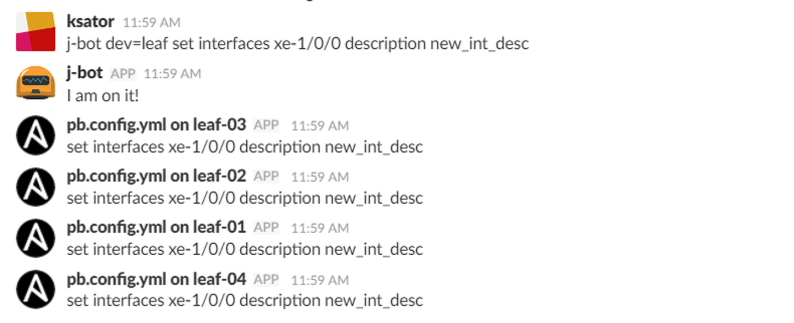
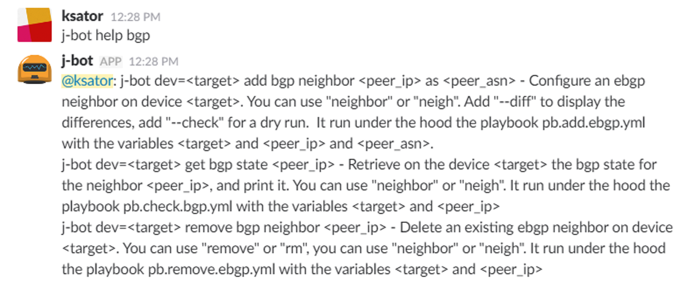
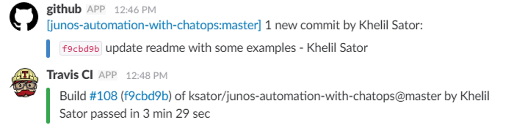

This repo is about chatops for Junos automation.  
Chatops is about humans chatting to Bots (and the other way around) to delegate tasks.   

This repo provides a dockerized and slack integrated hubot for junos automation.  
The repo is actually based on slack and hubot and junos automation content (ansible playbooks, python scripts, jinja2 templates ...): so we can delegate junos automation tasks chatting to hubot with slack.  

Few examples:    

Get details about a device:  
  

Rollback the Junos configuration:  
  

Backup the Junos configuration running on Junos devices on a server:  
  

Pass a Junos command (set, delete, show):  
  

Manage BGP neighbors (add a neighbor, remove a neighbor, audit a neighbor session):  
  

Github and TravisCI slack notifications:  
  

Please visit [wiki](https://github.com/ksator/junos-automation-with-chatops/wiki) to get all the [bot capabilities](https://github.com/ksator/junos-automation-with-chatops/wiki/03.-Bot-capabilities) and to get the installation and usage instructions.  
